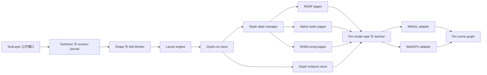

# pixi-glyphflow：面向 PixiJS 的极致性能文字渲染蓝图

`pixi-glyphflow` 应成为 PixiJS v8 的批量文字层：一个场景对象承载海量标签，共享字形图集、塑形与布局结果，通过增量 GPU 上传和渲染器专属执行路径完成绘制。性能领先由固定工作负载、同等视觉覆盖、受控内存和 WebGL/WebGPU 实测结果共同定义。

状态：2026-08-14 的未盖章设计提案。

本文采用三类证据：

- **项目证据**：`pixi-heatmap` 已经实现并验证的行为。
- **PixiJS 证据**：当前锁定的 PixiJS 包源码或官方文档。
- **设计提案**：`pixi-glyphflow` 的目标、接口、架构与验收门槛。

## 基线

| 项目 | 当前事实 | pixi-glyphflow 方向 |
| --- | --- | --- |
| PixiJS 版本 | `pixi-heatmap` 声明 `pixi.js: ^8.0.0`，锁文件解析到 `8.19.0`。 | 首版采用 `pixi.js: ^8.19.0`，开发环境精确锁定 `8.19.0`，CI 增加最新 v8 兼容任务。 |
| 渲染器 | 本项目通过一个公开层同时覆盖 WebGL 与 WebGPU。 | WebGL2 作为生产基线，WebGPU 作为加速适配器，Canvas 进入后续适配范围。 |
| 包结构 | ESM、PixiJS peer dependency、Worker 子路径、类型声明、`sideEffects: false`。 | 延续 ESM 与 peer dependency，增加显式注册、Worker 和 HarfBuzz 子路径。 |
| 性能证据 | 浏览器/GPU 探针、单测、实时 Demo、帧分位数、draw call、上传和内存指标共同维护。 | 文档站同时承担实时基准和发布声明来源。 |

版本证据：源项目的 [`package.json`](https://github.com/alexzhang1030/pixi-heatmap/blob/bd879b35206f7113b289bd0c8b0e32dcb3d70f8e/package.json)、[`pnpm-lock.yaml`](https://github.com/alexzhang1030/pixi-heatmap/blob/bd879b35206f7113b289bd0c8b0e32dcb3d70f8e/pnpm-lock.yaml) 和随资料包保存的 [technology-stack.md](references/pixi-heatmap/technology-stack.md)。

## PixiJS 文字与渲染清单

### PixiJS 现有文字路径

| 路径 | PixiJS v8 行为 | 对 pixi-glyphflow 的意义 |
| --- | --- | --- |
| `Text` | 浏览器 Canvas 把完整字符串栅格化为纹理；文字或样式变化触发重新栅格化；结果以类似 Sprite 的方式进入 Pixi 批处理。 | 作为浏览器原生文字的保真基线，以及完整文字 run 的兜底栅格器。 |
| `BitmapText` | 字形来自共享 bitmap font atlas；支持已加载字体、动态 bitmap font、SDF 和 MSDF；文字变化复用图集内容并重排字形。 | 作为首要性能基线；所有性能声明使用相同内容和样式覆盖进行对照。 |
| `HTMLText` | SVG `foreignObject` 提供 HTML/CSS 布局、emoji 和 RTL，通过异步纹理路径进入场景。 | 作为富文本布局与复杂排版的正确性参照。 |
| `SplitText` / `SplitBitmapText` | 每行、每词或每字符成为独立 display object。 | 稠密动画场景使用紧凑 glyph-instance store，降低 scene graph 基数。 |

官方资料：[文字系统总览](https://pixijs.com/8.x/guides/components/scene-objects/text)、[Canvas Text](https://pixijs.com/8.x/guides/components/scene-objects/text/canvas)、[Bitmap Text](https://pixijs.com/8.x/guides/components/scene-objects/text/bitmap)、[BitmapText API](https://pixijs.download/release/docs/scene.BitmapText.html)、[HTML Text](https://pixijs.com/8.x/guides/components/scene-objects/text/html)。

### PixiJS 8.19 实现事实

执行 `pnpm install` 后，锁定包提供可复现的源码快照：

- `BitmapText` 通过 `AbstractBitmapTextPipe` 创建代理 `Graphics`，每个已定位字符生成一个纹理字形 primitive，再交给 Graphics render pipe 批处理。
- `BitmapFontManager` 维护 1,000 条布局 LRU，复用已注册字体，并为新的字体组合创建 dynamic bitmap font。
- `DynamicBitmapFont` 把新出现的 grapheme cluster 栅格化到 atlas page，并在 page 增长时更新 texture source。
- Bitmap 布局路径完成 grapheme 分段、x-advance、kerning、换行与对齐，产出带位置的字符 run。
- `CanvasTextPipe` 使用文字、样式和分辨率形成 managed texture key；renderer resolution 变化会刷新 auto-resolution text。
- `BitmapTextPipe` 同时注册到 `ExtensionType.WebGLPipes` 和 `ExtensionType.WebGPUPipes`。

可复现源码入口：

- `node_modules/pixi.js/lib/scene/text-bitmap/AbstractBitmapTextPipe.mjs`
- `node_modules/pixi.js/lib/scene/text-bitmap/BitmapFontManager.mjs`
- `node_modules/pixi.js/lib/scene/text-bitmap/DynamicBitmapFont.mjs`
- `node_modules/pixi.js/lib/scene/text-bitmap/utils/getBitmapTextLayout.mjs`
- `node_modules/pixi.js/lib/scene/text/canvas/CanvasTextPipe.mjs`

这些文件由锁文件固定，定位为实现研究材料。包接口依赖 PixiJS 公共导出和官方扩展点。PixiJS 把 `WebGLPipes`、`WebGPUPipes` 和自定义 batcher 定义为扩展类型；`RenderPipe` 是包含四个构建与更新操作的 Advanced interface。参考 [PixiJS 架构](https://pixijs.com/8.x/guides/concepts/architecture)、[ExtensionType](https://pixijs.download/release/docs/extensions.ExtensionType.html) 和 [RenderPipe](https://pixijs.download/v8.18.1/docs/rendering.RenderPipe.html)。

### PixiJS 集成规则

1. `TextLayer` 继承 Pixi scene object，直接获得 position、scale、rotation、tint、alpha、mask、culling 和生命周期语义。
2. 一个显式 installer 为 WebGL 与 WebGPU 注册 `glyphflow` render pipe 和 batcher。
3. 共享 typed array 把 glyph instance 送入渲染器适配器；GLSL 与 WGSL 消费同一逻辑实例格式。
4. Atlas page 使用 Pixi `TextureSource` 的所有权语义和显式生命周期账本。Pixi 将像素源与纹理视图区分，并支持保留 source 时卸载 GPU 资源。参考 [Textures](https://pixijs.com/8.x/guides/components/textures)。
5. 少量 render group 分隔 world text、HUD text 和独立运动的文字层。Pixi 建议采用有策略的 render group 并通过 profile 验证。参考 [Render Groups](https://pixijs.com/8.x/guides/concepts/render-groups)。
6. 渲染器选择保持可观测。Pixi 当前将 WebGL 标为生产推荐路径，将 WebGPU 标为功能完整且持续成熟的路径。参考 [Renderers](https://pixijs.com/8.x/guides/components/renderers)。
7. Blend mode、shader family、atlas page set、mask 和 effect state 共同形成 batch key；场景顺序把相同 key 聚合在一起。Pixi 将 blend-mode 切换等状态变化列为 batch break。参考 [Performance Tips](https://pixijs.com/8.x/guides/concepts/performance-tips)。

## 从 pixi-heatmap 迁移的工程模式

| 已验证模式 | 项目证据 | pixi-glyphflow 应用 |
| --- | --- | --- |
| 一个深公开模块 | `HeatmapLayer` 在一个 `Container` 接口后统一拥有数据、渲染器选择、生命周期、调度和诊断。 | `TextLayer` 统一拥有标签、塑形 revision、atlas residency、GPU instance 和诊断。 |
| 共享逻辑契约与渲染器适配器 | 一个 density contract 同时供给 Pixi raster engine 与 WebGPU compute accelerator。 | 一个 glyph-run contract 同时供给 WebGL 与 WebGPU renderer adapter。 |
| Typed-array seam | 点数据和 Worker 结果通过 typed array 传输。 | glyph id、advance、position、color、atlas coordinate 和 label transform 通过 typed array 传输。 |
| Dirty range 上传 | 稳定 append frame 只上传变化范围。 | position、color 和 text 编辑只更新受影响的 instance range。 |
| 稳定 buffer identity | 长寿命 vertex array 在实测中优于重复替换 `Buffer.data`。 | glyph instance buffer 和 transform buffer 在普通 commit 期间保持身份稳定。 |
| 几何容量管理 | buffer 按几何级数增长，在 live size 缩小四倍后回收。 | instance、transform、command 和 atlas metadata buffer 采用相同策略。 |
| 有界 WebGPU staging | 四槽 mapped staging ring 把大批上传转为 copy submission。 | 动态标签负载通过 mapped ring 上传变化的 glyph 与 transform range。 |
| Dirty gate | 静态数据完成构建后，layer update 工作归零。 | 静态标签跨帧保留 layout、atlas 和 GPU instance；相机变换留在 GPU。 |
| 稳定 render root | root/child 结构稳定，一个 render call 收集一次 frame draw work。 | text batch 保持稳定 root，通过 count 与 flag 控制可见性。 |
| 显式资源所有权 | geometry、buffer、bind group、texture、shader 和 cached program 各有独立 teardown 规则。 | 每个 atlas page、glyph view、pipeline、staging slot 和 Worker revision 只有一个所有者。 |
| 不可变异步身份 | Worker request 携带 source version、configuration、range 和 generation。 | shaping/layout/raster job 携带 text revision、font revision、feature、locale、direction、wrap width 和 atlas generation。 |
| 能力检查 | 渲染器专属加速路径报告选中 engine、limit 和 fallback。 | `TextLayer.stats` 报告 shaping engine、glyph mode、atlas page、draw call、upload、eviction 和 renderer adapter。 |
| 浏览器验收 | 真实交互测试 hash 实际 source state，并串行运行 GPU-heavy probe。 | 文字探针 hash glyph run 与 atlas generation，通过像素输出校验视觉一致性，并串行运行 GPU workload。 |

项目入口：[architecture.md](references/pixi-heatmap/architecture.md)、[optimization.md](references/pixi-heatmap/optimization.md)、[gotchas.md](references/pixi-heatmap/gotchas.md)、[`HeatmapLayer.ts`](https://github.com/alexzhang1030/pixi-heatmap/blob/bd879b35206f7113b289bd0c8b0e32dcb3d70f8e/src/HeatmapLayer.ts)、[`IntensityPass.ts`](https://github.com/alexzhang1030/pixi-heatmap/blob/bd879b35206f7113b289bd0c8b0e32dcb3d70f8e/src/intensity/IntensityPass.ts)、[`StagingUploader.ts`](https://github.com/alexzhang1030/pixi-heatmap/blob/bd879b35206f7113b289bd0c8b0e32dcb3d70f8e/src/intensity/webgpu/StagingUploader.ts)、[`webgpu-pipeline-format.ts`](https://github.com/alexzhang1030/pixi-heatmap/blob/bd879b35206f7113b289bd0c8b0e32dcb3d70f8e/src/webgpu-pipeline-format.ts)、[`lifecycle.test.ts`](https://github.com/alexzhang1030/pixi-heatmap/blob/bd879b35206f7113b289bd0c8b0e32dcb3d70f8e/tests/lifecycle.test.ts)。

## 产品契约

### 目标工作负载

“性能最好”按工作负载独立验收，发布看板持续保留以下分组：

| 工作负载 | Fixture | 主要压力 |
| --- | --- | --- |
| 稠密地图标签 | 100,000 个 label、1,000,000 个可见 glyph、共享 camera transform | scene traversal、instance count、culling、draw submission |
| 动态计数器 | 10,000 个 label、80,000 个 glyph、每帧 10% 字符串变化 | shape/layout cache、dirty compaction、partial upload |
| 多语言流式 UI | Latin、CJK、Arabic、Devanagari、emoji；每秒 1,000 次 label mutation | shaping correctness、font fallback、atlas miss、异步连续性 |
| 排版缩放扫描 | camera scale 从 0.25x 到 16x，并包含 rotation | SDF/MSDF 质量、raster path 切换、cache 稳定性 |
| Atlas 压力 | 固定内存上限内遍历 20,000 个唯一 CJK/emoji grapheme | packing、eviction、generation safety、upload bandwidth |
| 静态 HUD | 1,000 个带效果且文字稳定的 label | steady-state CPU、draw count、memory retention |

### 小型公开接口

公开 seam 只暴露标签 mutation 与生命周期；塑形、字形生成、packing、batching 和 upload scheduling 都留在实现内部。

```ts
import { TextLayer } from "pixi-glyphflow"

const layer = new TextLayer({
  shaping: "auto",
  glyphMode: "auto",
  atlas: { maxBytes: 64 * 1024 * 1024 },
})

app.stage.addChild(layer)
layer.attach(app.renderer)

const fpsLabel = layer.create({
  text: "上海 120 FPS",
  x: 24,
  y: 24,
  style: {
    fontFamily: "Inter, Noto Sans CJK SC",
    fontSize: 18,
    fill: 0xffffff,
  },
})

layer.updateLabel(fpsLabel, { text: "上海 121 FPS" })
await layer.commit()

layer.remove(fpsLabel)
layer.destroy()
```

提议的核心操作：

- `create(spec): TextId`
- `updateLabel(id, patch): void`
- `remove(id): void`
- `commit(): Promise<TextRevision>`
- `attach(renderer): void` 与 `detach(): void`
- `destroy(): void`
- `stats: Readonly<TextLayerStats>`

常规路径完成测量后，批量生产者获得 typed trusted-run 入口。这个入口以 O(1) 采用已经塑形的 glyph run、精确 bounds 和 atlas key，并沿用 `setRawTrusted()` 的所有权纪律。

## 架构提案



### 模块职责

| Module | Interface 职责 | Implementation 职责 |
| --- | --- | --- |
| `TextLayer` | label create/mutate/commit、Pixi transform/lifecycle、stats | 协调所有内部模块，只发布完整 revision。 |
| `TextStore` | 稳定 `TextId` 和已接受 label state | Structure-of-arrays、free-list reuse、dirty journal、bounds metadata。 |
| `FontRegistry` | font registration 和 fallback-family name | font bytes、revision hash、variation axis、feature default、fallback resolution。 |
| `Shaper` | UTF-16 text 加 font/feature/locale/direction 转 glyph run | HarfBuzz-WASM Worker、script segmentation、bidi ordering、cluster mapping、cache key。 |
| `LayoutEngine` | glyph run 加 width/alignment/line rule 转 positioned run | line break、wrap、alignment、baseline metric、truncation、bounds。 |
| `GlyphAtlas` | glyph key 转 resident atlas entry | page packing、raster/MSDF generation、padding、upload queue、pinning、eviction、generation。 |
| `GlyphInstanceStore` | complete positioned run 转 renderer-ready range | 目标 32 B/glyph 以内、稳定 capacity、compaction、dirty coalescing。 |
| `GlyphflowPipe` | 为 `TextLayer` 构建 Pixi render instruction | batch key、culling、atlas binding、transform palette、draw submission。 |
| Renderer adapter | 共享 upload/draw contract | WebGL buffer update 与 WebGPU mapped staging/copy scheduling。 |

删除测试成立：移除 `TextLayer` 后，shaping revision、atlas residency、dirty compaction、batching 和 renderer selection 会分散到所有 caller。这个模块通过集中复杂度获得深度。

## 渲染设计

### 字形模式

| Mode | 最佳内容 | Atlas format | Shader 工作 |
| --- | --- | --- | --- |
| MSDF | 可缩放 UI 字体、地图标签、宽 zoom range | RGB/RGBA distance field | median-distance reconstruction、edge smoothing、tint |
| SDF | 小型单色字符集与紧凑内存配置 | single-channel distance field | distance threshold、smoothing、tint |
| Alpha raster | 原生尺寸 CJK 与浏览器栅格字形 | single-channel coverage | coverage sample、tint |
| Color raster | emoji 与 color glyph | premultiplied RGBA | texture sample、layer tint/alpha |

`glyphMode: "auto"` 根据字体能力、预计缩放范围、效果需求和 atlas 压力选择稳定模式。显式模式拥有最终优先级。一个 label 在同一 source revision 内保持选中模式，保证 shader 与 atlas 路径稳定。

### 塑形与布局

Grapheme segmentation 提供面向用户的 cluster。完整 shaping 还需要解析 glyph id、ligature、contextual form、kerning、script direction 和 font fallback。因此，高覆盖路径使用 Worker 内的 HarfBuzz，并为 already-shaped run 和简单预构建 bitmap font 保留紧凑 fast path。

Shape cache key：

```text
text + font revision + size + variation axes + OpenType features
+ language + script + direction + fallback chain
```

Layout cache 继续加入：

```text
wrap width + line height + alignment + letter spacing + truncation policy
```

Cache value 采用 immutable 数据；font revision 或 fallback-chain revision 自然形成新 key。

### Instance 与 transform 存储

M1 目标为每个 glyph 至多 32 B，shared atlas texture 和 label transform 单独核算。1,000,000 个 glyph instance 至多占用 30.52 MiB。候选字段包括 local position、glyph size、packed UV rectangle、premultiplied color、atlas page/mode 和 transform index。

每个 label 的 position、scale、rotation、alpha 和 visibility 存入 dense transform palette。Camera transform 放在 `TextLayer` Pixi node 上，稠密地图移动只产生 GPU transform update。单个 label 编辑只触碰一条 palette entry，并保留 glyph instance。

容量策略沿用 heatmap 的实测方案：

- 从小型 power-of-two block 起步；
- 按几何级数增长；
- 普通编辑期间保持 buffer identity；
- 通过显式操作完成 compaction；
- live size 缩小四倍后收缩；
- 最多保留一个 spare chunk。

### Dirty 传播

| 变化 | Shape | Layout | Atlas | Glyph instance | Transform palette |
| --- | ---: | ---: | ---: | ---: | ---: |
| x/y/rotation/scale/alpha |  |  |  |  | 更新一条 entry |
| fill color |  |  |  | 更新受影响 range |  |
| text | recompute/cache hit | recompute/cache hit | ensure glyphs | 替换受影响 range |  |
| font/features/language/direction | recompute | recompute | ensure glyphs | 替换受影响 range |  |
| wrap width/alignment/line height |  | recompute |  | 替换受影响 range |  |
| atlas eviction/repack |  |  | 新 generation | patch UV/page range |  |
| layer camera transform |  |  |  |  | 只更新 Pixi layer transform |

每个异步结果携带 label revision、font revision、shape key、layout key、atlas generation 和 destination range。当前完整 generation 持续显示，新 generation 在 frame boundary 原子切换。

### Batch 与 draw 模型

1. 通过 layer bounds 和可选 spatial tile 完成 label culling。
2. 在保留应用 z-order 的前提下，按 glyph mode、blend mode、mask/effect state 和 atlas page set 形成稳定 batch segment。
3. 每个 batch 绑定多个 atlas page，数量遵循 renderer 上报的 texture limit。
4. 通过 instanced quad 绘制，每个 glyph 对应一个 instance。
5. Fill-only text 使用一次 pass；stroke、shadow 和 glow 通过显式 shader branch 或有界额外 pass 实现，并单独记录 benchmark。
6. `stats` 发布 draw call、instance、page binding、batch break 和 effect pass。

首个 renderer adapter 使用官方 Pixi RenderPipe/Batcher extension seam。Advanced renderer detail 集中放在 `src/pixi/compat/`，配套 startup shape check 和 exact-version test，使兼容风险保持局部。

### 上传模型

- WebGL 合并 dirty range，通过 renderer adapter 提交 offset-aware buffer update。
- WebGPU 通过有界 mapped staging ring 复制变化范围，并在文字渲染前提交 copy-only command。
- Atlas upload 使用矩形 subresource update，并遵循每帧 byte budget。
- Shape/layout Worker 返回 transferable typed array 和 immutable metadata。
- 文字稳定的 steady-state frame 产生零 shaping、零 layout、零 atlas work 和零 instance upload。

## 性能与正确性门槛

### 竞争性发布门槛

满足以下条件的 tagged package 才启用“性能领先”标签：

1. Dense-map 与 dynamic-counter 的 frame p95 至多为 PixiJS 8.19 `BitmapText` 基线的 `0.75x`，可见内容和样式覆盖保持一致。
2. 所有已支持 workload 的 frame p95 至多为对应 `BitmapText` 基线的 `1.00x`。
3. 静态 steady state 在 warm-up 后记录零 shape/layout/atlas/instance work 和零 JavaScript allocation。
4. 参考 M1 Pro fixture 上，dynamic-counter main-thread update p95 低于 1.5 ms。
5. Atlas memory 始终处于配置上限内，temporary repack generation 计入总量。
6. WebGL 与 WebGPU pixel comparison 处于公开的 SDF/raster tolerance 内。
7. Complex-script fixture 的 glyph id、cluster boundary、advance、line break 和 visual golden 与参照一致。

### 必备指标

- time to first visible text；
- shape、layout、raster、atlas-pack、upload、layer-update 的 p50/p95/p99；
- complete frame p50/p95/p99 和 native refresh dropped-frame ratio；
- draw call、batch break、visible glyph、submitted glyph、culled label；
- CPU source bytes、GPU instance bytes、atlas bytes、staging high-water mark、cache size；
- atlas hit、miss、upload、eviction、repack、generation swap；
- Worker queue depth、stale-result count、fallback count；
- renderer name、device limit、browser version、DPR、canvas size、refresh rate。

### 基准方法

1. 在功能覆盖重叠的 fixture 上对照 PixiJS `Text`、`BitmapText`、`HTMLText` 和 pixi-glyphflow。
2. 显式 warm up font、pipeline 和 atlas；cold 与 warm 结果分开报告。
3. Dynamic test 每帧修改真实 string 和 position。
4. 交互期间采样完整 glyph-run hash 与 atlas-generation hash。
5. WebGL 与 WebGPU browser probe 串行运行。
6. 通过 browser screenshot 或 8-bit canvas extraction 捕获可见输出，并与 golden 对比。
7. Benchmark source count 与实际接受的 label 和提交的 glyph run 保持一致。
8. Raw JSON 与生成表格、图表共同保存。

首个参考矩阵包含 Apple M1 Pro 120 Hz Chrome、同机 Safari、iPhone/iPad WebGL 路径和 Windows 独立显卡路径。每条声明携带 browser 与 hardware label。

## PixiJS 专属风险与控制

| 风险 | 控制 |
| --- | --- |
| Advanced extension interface 演进 | `src/pixi/compat/` 独占 adapter；startup check 与 exact-plus-latest PixiJS CI matrix 提供覆盖。 |
| WebGPU browser variance | WebGL 保持基线 adapter；逐帧 capability decision 和 fallback counter 保持可观测。 |
| Shared shader/program lifetime | Instance 与 binding 归 layer 所有；cached program 使用 process lifetime；sibling-layer lifecycle test 覆盖 teardown。 |
| Texture 与 bind-group invalidation | 新 atlas source 完成绑定后再退休旧 generation；销毁顺序遵循所有权表。 |
| 多 Pixi Application | Application-level resource 使用 reference count；sibling-app destruction test 覆盖 shared registry。 |
| Atlas fragmentation | fixed page size、skyline/free-rect metric、visible glyph pinning、bounded generation 和 repack threshold 共同治理。 |
| 异步期间空帧 | last-complete-generation display 与 frame-boundary swap 保持连续画面。 |
| Complex-script correctness | HarfBuzz fixture、font hash、bidi case、fallback case 和 visual golden 形成 release gate。 |
| Batch explosion | batch-key telemetry 明确标出 page、shader、blend、mask 和 effect 原因。 |
| Accessibility | 可选 DOM accessibility adapter 为选定 label 镜像 text、role、bounds 和 focus order。 |

需要立即建立对应回归的 heatmap 陷阱记录在 [gotchas.md](references/pixi-heatmap/gotchas.md)：shared shader destruction、render-target rebind order、root-mesh blend semantic、stable `Buffer.data`、WebGPU staging lifetime、headless GPU readback 和 multi-application destruction。

## 包与仓库形态

```text
pixi-glyphflow/
├── src/
│   ├── TextLayer.ts
│   ├── types.ts
│   ├── store/
│   ├── shaping/
│   ├── layout/
│   ├── atlas/
│   ├── render/
│   ├── pixi/compat/
│   └── worker/text-worker.ts
├── tests/
├── scripts/
├── docs/
├── package.json
└── pnpm-workspace.yaml
```

提议 exports：

| Export | 用途 |
| --- | --- |
| `pixi-glyphflow` | `TextLayer`、类型、字体注册、stats |
| `pixi-glyphflow/worker` | Worker entry 和 protocol type |
| `pixi-glyphflow/register` | Pixi render extension 的 side-effect registration |
| `pixi-glyphflow/harfbuzz` | 可选 shaping adapter 与 WASM loader |

Core entry 保持 side-effect free。`installGlyphflow()` 提供显式注册；`/register` 提供 import-time registration，并成为包内唯一标记 side effect 的路径。

## 实施里程碑

### M0 — 基线实验室

- 为 PixiJS 8.19 的 `Text`、`BitmapText` 和 `HTMLText` 建立相同 fixture。
- 记录 cold/warm timing、draw call、texture memory、update cost 和 visual output。
- 加入 browser hook 与 raw JSON report。
- 固化首批 workload definition 和 pass budget。

### M1 — 稠密 MSDF Layer

- 实现 `TextLayer`、`TextStore`、prebuilt MSDF font loading、positioned glyph run 和 instanced quad。
- 实现 WebGL render pipe、batch telemetry、dirty range、geometric capacity、culling 和 lifecycle test。
- 在 dense-map fixture 上达到 `BitmapText` 竞争门槛。

### M2 — WebGPU Adapter

- 加入 WGSL、mapped staging upload、copy-only submission、device-limit planning 和 fallback diagnostic。
- 串行运行 WebGL/WebGPU visual parity 与 performance probe。

### M3 — Dynamic Atlas

- 加入 alpha/RGBA page、glyph raster job、memory cap、pinning、eviction 和 frame-boundary generation swap。
- 覆盖 CJK 与 emoji atlas-pressure fixture。

### M4 — 完整塑形

- 加入 HarfBuzz-WASM Worker shaping、bidi、font fallback、OpenType feature、variation 和 complex-script golden。
- 为已有 shaping engine 提供 trusted shaped-run interface。

### M5 — 产品与发布

- 交付 live docs、API reference、benchmark dashboard、package smoke test、CI、OIDC publish、provenance、signed tag 和 release note。
- 所有发布声明引用 tagged raw benchmark artifact。

## 第一个具体步骤

在新的 `pixi-glyphflow` 仓库中从 M0 开始，复用本项目的 workspace、package、docs、benchmark、lifecycle 和 release-gate 结构。首个实现目标是单个 `TextLayer` 承载 1,000,000 个 prebuilt-MSDF glyph，并在 dense-map 与 dynamic-counter fixture 上对照 PixiJS 8.19 `BitmapText`。
