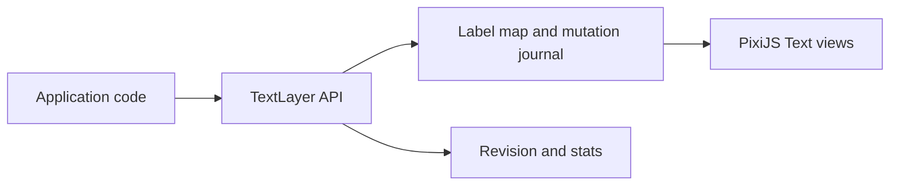

# POC contract

`pixi-glyphflow@0.0.1` reserves the npm package and proves the first public contract with a visible,
testable PixiJS implementation.

## Objective

The POC establishes four durable seams before the performance renderer arrives:

1. One `TextLayer` participates in the PixiJS scene graph.
2. Callers mutate labels through stable `TextId` values.
3. `commit()` publishes mutations through a monotonic revision boundary.
4. `stats` and `attach()` establish renderer diagnostics and resource ownership.

## Implementation boundary

| Area              | `0.0.1` POC                                    | M1 direction                                                |
| ----------------- | ---------------------------------------------- | ----------------------------------------------------------- |
| Scene integration | `TextLayer extends Container<Text>`            | One renderable layer with a glyphflow render pipe           |
| Label identity    | Stable, monotonic numeric `TextId`             | Stable IDs backed by a dense store and free-list reuse      |
| Rendering         | One Canvas Text object per label               | Shared MSDF atlas and instanced glyph quads                 |
| Commit            | Eager view updates plus revision publication   | Atomic shaping, atlas, instance, and GPU upload publication |
| Diagnostics       | Label, mutation, revision, attachment, backend | Draw, upload, atlas, cache, fallback, and renderer metrics  |

Performance claims begin when M1 fixtures satisfy the release gates in the
[project blueprint](https://github.com/alexzhang1030/pixi-glyphflow/blob/main/.agents/docs/pixi-glyphflow-blueprint.md#performance-budgets).

## Public API

The package exports:

- `TextLayer`
- `TextId`
- `TextRevision`
- `TextLabelSpec`
- `TextLabelPatch`
- `TextLayerStats`

The `0.0.x` line gives the contract room to evolve through the benchmark phase. Every published
change receives a changelog entry and package-shape verification.

## Verification gate

`bun run check` runs these gates in order:

1. Oxfmt check
2. Oxlint
3. TypeScript 7 typecheck
4. Bun tests
5. tsdown build
6. publint
7. Are the Types Wrong with the ESM-only profile

`bun run audit` adds the registry vulnerability gate. `npm pack --dry-run` exposes the exact
tarball manifest before publication.

`bun run package:smoke` installs the real tarball in an isolated consumer, executes the public API,
and compiles that consumer with TypeScript 7. The consumer probe enables `skipLibCheck` because
PixiJS 8.19 brings `@webgpu/types@0.1.71` while TypeScript 7 also supplies WebGPU declarations through
`lib.dom`.

## Release path

The first release uses an authenticated maintainer session to establish the package. Publishing a
GitHub Release activates `.github/workflows/release.yml` with npm Trusted Publishing, GitHub OIDC,
and automatic provenance. The trusted-publisher entry uses repository
`alexzhang1030/pixi-glyphflow`, workflow `release.yml`, environment `npm`, and the `npm publish`
action.
